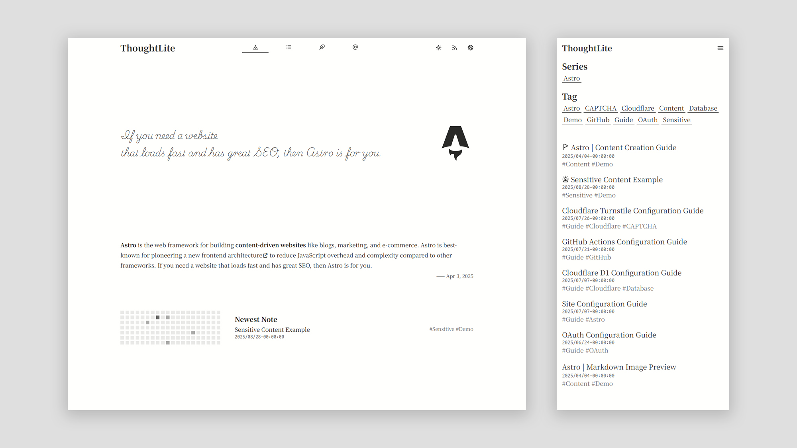
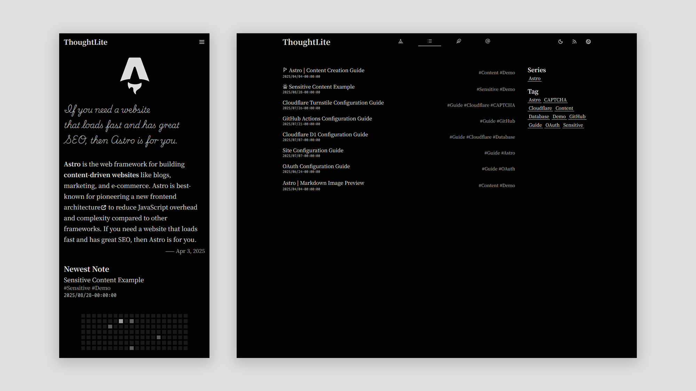

# ThoughtLite

<div align="center">
    <p>
        
        
    </p>
    <p>
        <a href="https://raw.githubusercontent.com/tuyuritio/astro-theme-thought-lite/refs/heads/main/LICENSE"></a>
    </p>
    <p>A modern <a href="https://astro.build/">Astro</a> theme, focused on content creation 🌟</p>
</div>

> [!NOTE]
> - `main` branch✅: Static build, can be deployed on any static hosting platform.

🎬 **Live Demo**: [Vercel](https://thought-lite-plus-demo.vercel.app/)

## ✨ Features

- [x] **Responsive Design** - Adaptive for mobile, tablet, and desktop.
- [x] **Light / Dark Mode** - Auto-follows system preference with manual toggle support.
- [x] **CSR Dynamic Content Filtering** - List filtering and pagination via History API.
- [x] **i18n Support** - Extensible multilingual support, also works perfectly in monolingual mode.
- [x] **Sitemap & Feed Subscription** - Automated generation of Sitemap and Atom Feed.
- [x] **OpenGraph Support** - Built-in Open Graph meta tags for optimized social media sharing.

## ⚡️ Quick Start

### Using Astro Command

Run the following command:

```sh
pnpm create astro --template Mapleshade20/astro-theme-thought-lite

# Follow the interactive prompts to create the project

cd <your-project-name>
pnpm dev
```

### Using Template

1. [Use this template](https://github.com/new?template_name=astro-theme-thought-lite&template_owner=Mapleshade20) to create a new repository or [fork](https://github.com/Mapleshade20/astro-theme-thought-lite/fork) this repository.
2. Run the following commands:

```sh
git clone <your-repo-url>
cd <your-repo-name>
pnpm install
pnpm dev
```

## 🔧 Configuration

Customize site configuration and internationalization (i18n) by modifying the following files:

- `.env`
- `astro.config.ts`
- `site.config.ts`

For basic configuration, refer to the [Site Configuration Guide](src/content/note/en/configuration.md).

For i18n configuration, refer to the [Internationalization Configuration Guide](src/content/note/en/internationalization.md).

## 💻 Commands

The theme provides the following commonly used commands:

| Command | Action |
| --- | --- |
| `pnpm install` | Install project dependencies |
| `pnpm update` | Update project dependencies |
| `pnpm new` | Create a new content file |
| `pnpm dev` | Start the local development server (default: `http://localhost:4321`) |
| `pnpm check` | Run Astro type checking |
| `pnpm build` | Build the production version |
| `pnpm preview` | Preview the built site |
| `pnpm format` | Format code |
| `pnpm lint` | Lint code |

## 🚀 Deployment

The current branch can be fully static built and deployed on any static hosting platform.

For deployment methods on various platforms, refer to the [Astro Official Deployment Guide](https://docs.astro.build/en/guides/deploy/).

## 🔄 Updates

Run the following commands to sync upstream updates:

```sh
git remote add theme https://github.com/Mapleshade20/astro-theme-thought-lite.git
git fetch theme
git merge theme/main    # Add `--allow-unrelated-histories` flag for first update
pnpm install
```

## ✍️ Content Creation

Content creation is centralized in the `src/content` directory, mainly including:

- `note` - Focused on carefully crafted and detailed long-form works
- `jotting` - Lightweight and immediate content recording
- `knowledge` (aka. library) - Demonstrate your reading activities and notes
- `preface` - Displayed on the homepage as the first impression
- `information` - Containing various descriptive content

For details, refer to the [Content Creation Guide](src/content/note/en/content.md).

## 🙏 Acknowledgments

Forked from [tuyuritio/astro-theme-thought-lite](https://github.com/tuyuritio/astro-theme-thought-lite)

## 📜 License

This project is licensed under [GPLv3](LICENSE), allowing free modification and distribution, but the original copyright notice must be retained.
